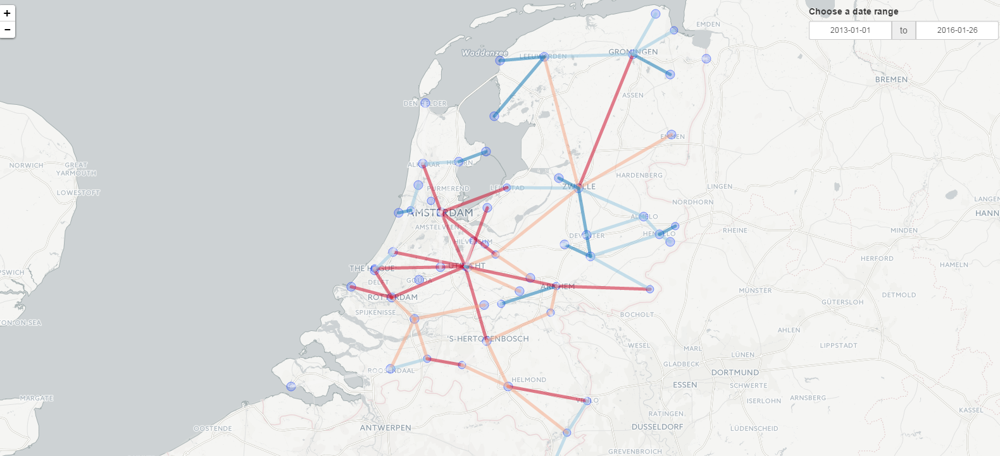

# Webscraping project for train delays in the Netherlands

As a practice exercise for a data science accelerator program, we will write a program to scrape NS (dutch rail company) delays.

Our goal is to gain insight on which trajectories delays happen most often. Basic approach was: 
- Webscrape [rijdendetreinen.nl](http://www.rijdendetreinen.nl/storingen) for each delay, using rvest
- Add geo data for each station
- Visualize each trajectory using leaflet and shiny

# Result

The interactive shiny application shows each trajectory. A deeper red colours means more delays on that trajectory

# Collaborators
- Chris Broeren
- Tim Vink

# Possible next steps
The data contains interesting data on amount, duration and type of delays sinds januari 2011. There are many more possible analysis to be made. Of course the code could be refactored, f.e. to include unit tests for edge cases. 

